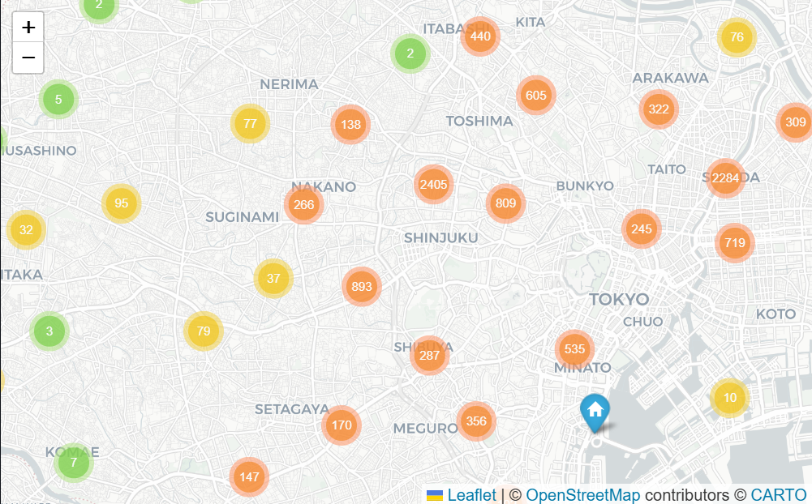
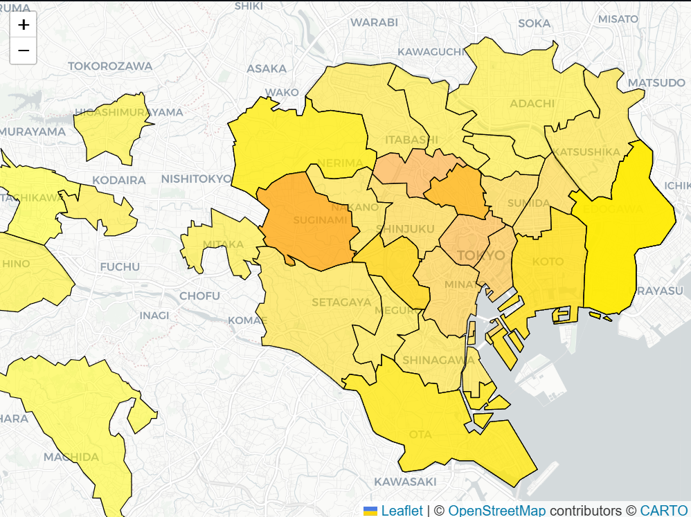
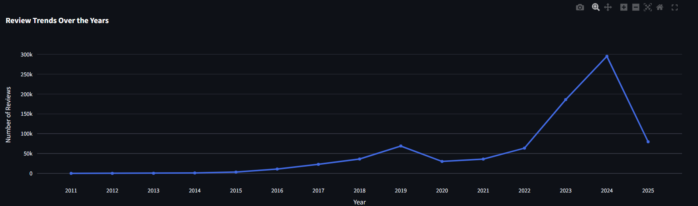
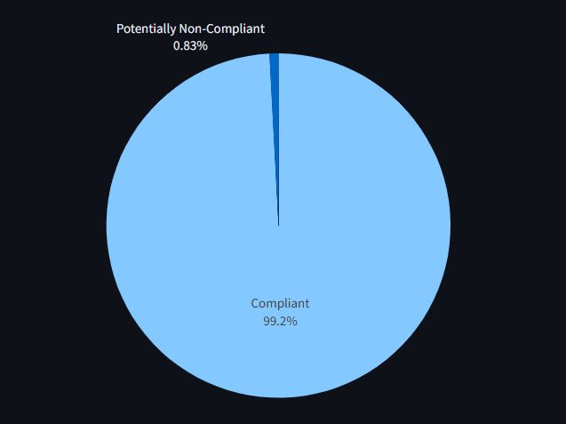

# 🏙️ Tokyo Airbnb Analysis – EDA + Streamlit Dashboard

This project analyzes Airbnb listings in Tokyo, Japan, using a combination of a **Jupyter Notebook** and a **Streamlit web app**.

---

## 📁 Files Included

| File | Description |
|------|-------------|
| `main.ipynb` | Complete Exploratory Data Analysis (EDA) in notebook form — data cleaning, feature engineering, visualizations |
| `app.py` | Streamlit dashboard showcasing key insights and interactive visualizations |

---

## 📊 What’s Covered

The analysis explores:

- Distribution of listings by neighborhood
- Interactive cluster maps of listing locations
- Listing types, licenses, and availability patterns
- Identification of non-compliant listings (Minpaku law + smoke alarm)
- Review trends before and after COVID
- Top hosts and top-rated listings
- Choropleth maps for neighborhood-level pricing
- High-value listings (high ratings, low price, many reviews)


## 🖼️ Sample Screenshots


### 💎 Listings in Tokyo



### 🗺️ Average Price by Neighborhood


---

### 📈 Review Trends Over the Years


---

### 🚨 Non-Compliant Listings (Minpaku + Smoke Alarm)



## 🚀 Running the Streamlit App

After placing the data:

```bash
pip install -r requirements.txt
streamlit run app.py


